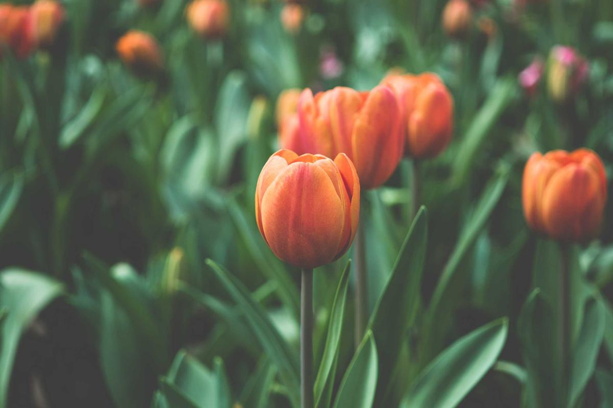
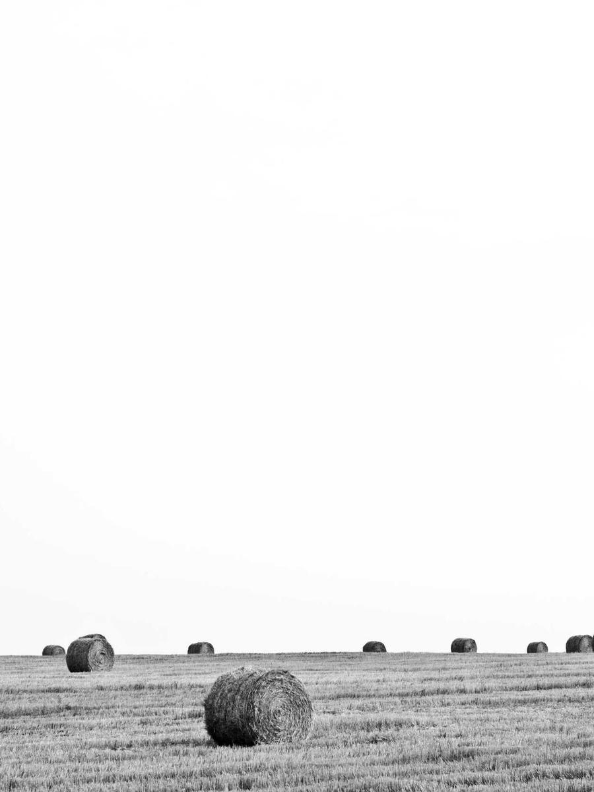

## 这篇文章是干什么的

本站之前文章都不带封面，列表卡片用右侧一张竖条小图展示，图片比例不对会被**直接拉伸变形**，看起来不舒服。这篇示例文章配了一张封面图，用来验证新的封面方案：

- **桌面端**：封面是卡片顶部通栏横幅，宽高比固定 **5:2**（超高时最高 300px），图片按 `object-fit: cover` **等比裁切**、绝不拉伸；
- **手机端**：改为 **16:9** 横幅，高度更克制，同样等比裁切；
- 悬停封面会轻微放大并浮现「阅读全文」胶囊（桌面端）。

这篇文章本身放在 `src/content/posts/demo/` 下，属于独立的「示例」分类，看完可以直接把整个 `demo` 目录删掉。

## 正文插图（标准横图）

图片就放在文章同目录的 `images/` 文件夹里，markdown 里用相对路径即可：



正文图片支持点击放大（PhotoSwipe 灯箱），上图可以点一下试试。

## 正文插图（竖幅构图）

再放一张竖图，看看不同构图在正文里的表现：



横幅在列表里会被裁成 5:2（手机 16:9），但正文里始终**按原始比例完整显示**，互不影响。

## 封面图引用方式

封面上这张图就是 `frontmatter` 里的这一行：

```yaml
image: images/cover.jpg
```

图片本身放在 `src/content/posts/demo/images/cover.jpg`（相对本文件的 `images/` 子目录），构建时由 `ImageWrapper` 走 Astro 的图片管线做 WebP 优化与响应式尺寸输出。

> 小贴士：可以用任意比例的图当封面，裁切结果由 CSS 保证一致，不用手工改图。